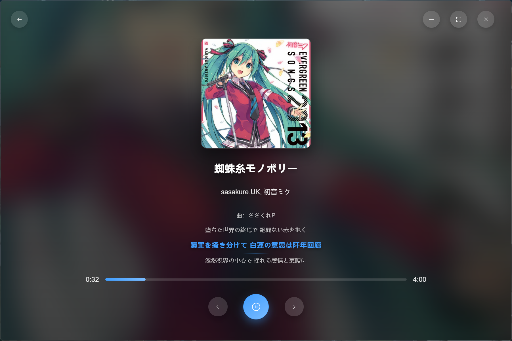
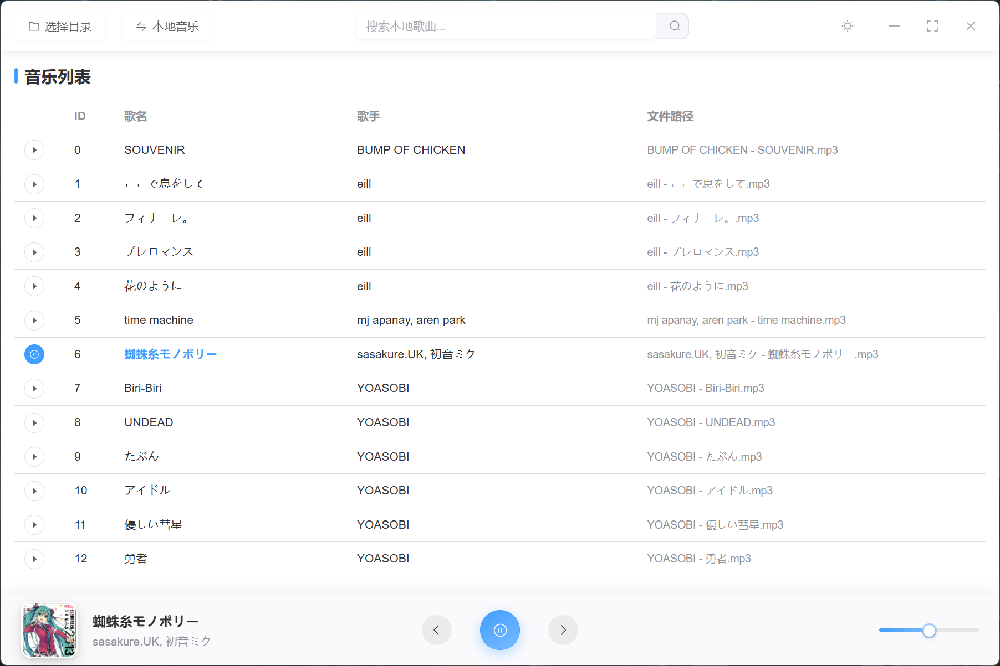

# Rmusic

A modern, lightweight cross-platform desktop music player built with Tauri 2 and Vue 3. Play local audio files and stream online music through third-party API proxies.

[English](README.md) | [中文](README_zh.md)

[](LICENSE)
[](https://github.com/xudong7/tauri-rmusic/releases)
[](https://tauri.app/)
[](https://vuejs.org/)

---

## Table of Contents

- [Screenshots](#screenshots)
- [Features](#features)
- [Technology Stack](#technology-stack)
- [Getting Started](#getting-started)
- [Online Music](#online-music)
- [Usage](#usage)
- [Contributing](#contributing)
- [Roadmap](#roadmap)
- [License](#license)
- [Acknowledgements](#acknowledgements)

---

## Screenshots

 

 

---

## Features

| Category             | Description                                                                     |
| -------------------- | ------------------------------------------------------------------------------- |
| **Cross-platform**   | Windows, macOS, Linux                                                           |
| **Performance**      | Rust + Tauri for minimal footprint and fast startup                             |
| **Local playback**   | Scan folders; play MP3, WAV, OGG, FLAC                                          |
| **Online streaming** | Search and play via KuGou and NetEase APIs (requires local proxy)               |
| **UI**               | Vue 3 + Element Plus; light/dark and time-based auto theme                      |
| **Playback**         | Volume, progress, repeat, shuffle; lyrics and immersive full-screen mode        |
| **Convenience**      | System tray, keyboard shortcuts (space, arrows), download with cover and lyrics |
| **Settings**         | Theme, download path, library scan, cache management                            |

---

## Technology Stack

| Layer    | Technologies                                     |
| -------- | ------------------------------------------------ |
| Frontend | Vue 3, Element Plus, Vue Router, Pinia, Vue I18n |
| Backend  | Rust, Tauri 2.0                                  |
| Audio    | Rodio                                            |
| Network  | Reqwest, Tokio                                   |
| Build    | Vite, Cargo                                      |

---

## Getting Started

### Prerequisites

- **Node.js** 16+
- **Rust** and Cargo ([rustup](https://rustup.rs/))
- **npm** or **pnpm**

### Install and Run

```bash
git clone https://github.com/xudong7/tauri-rmusic.git
cd tauri-rmusic
npm install
npm run tauri dev
```

Or with pnpm:

```bash
pnpm install
pnpm exec tauri dev
```

### Build for Production

```bash
npm run tauri build
```

Output: `src-tauri/target/release/` (or `release/bundle/` for installers).

---

## Online Music

Online streaming depends on two local API proxies. Start both before using the "Online Music" tab.

| Service                    | URL                     | Repository                                                                                    |
| -------------------------- | ----------------------- | --------------------------------------------------------------------------------------------- |
| NeteaseCloudMusicApiBackup | `http://localhost:3000` | [nooblong/NeteaseCloudMusicApiBackup](https://github.com/nooblong/NeteaseCloudMusicApiBackup) |
| KuGouMusicApi              | `http://localhost:3001` | [MakcRe/KuGouMusicApi](https://github.com/MakcRe/KuGouMusicApi)                               |

**Steps:**

1. Clone, configure, and run both services on the ports above.
2. In Rmusic, open **Online Music** from the navigation.
3. Search and play; use the download action to save tracks with cover and lyrics.

---

## Usage

1. **Local music** — Choose a music folder; the app scans and lists supported formats. Click a track to play.
2. **Online music** — Open the Online Music page, search, then play or download.
3. **Playback** — Use the bottom bar or shortcuts: `Space` (play/pause), `Left`/`Right` (previous/next).
4. **Immersive mode** — Click the cover in the player bar for full-screen lyrics and visuals.
5. **Settings** — Use the settings entry to change theme, download directory, scan options, and cache.

---

## Contributing

Contributions are welcome. Here are some ways to help:

- **Bug fixes** — Report or fix issues.
- **Features** — New playback or UI improvements.
- **Docs** — README, code comments, or guides.
- **UI/UX** — Layout, accessibility, and workflow improvements.
- **i18n** — New or updated translations.
- **Tests** — Unit or integration tests.
- **Ideas** — Open an Issue to discuss.

**Process:**

1. Fork the repo.
2. Create a branch: `git checkout -b feature/your-feature`.
3. Commit: `git commit -m 'feat: your change'`.
4. Push: `git push origin feature/your-feature`.
5. Open a Pull Request.

Keep the existing style and add comments for non-obvious logic. For large changes, start with an Issue.

---

## Roadmap

- [x] Repeat and shuffle modes
- [x] Settings: library scan, cache
- [ ] Theme customization (accent colors)
- [ ] i18n for more languages
- [ ] More music sources
- [ ] Import/export library and playlists
- [ ] Now playing notifications

---

## Disclaimer

<details>
<summary>Legal and usage notice (click to expand)</summary>

1. This project is for learning only. Do not use it for commercial or illegal purposes. Respect copyright.
2. Any copyrighted data produced while using this project is not owned by the project. You must delete such data within 24 hours to reduce infringement risk.
3. The authors are not liable for any direct, indirect, special, incidental, or consequential damages from using this project.
4. Do not use this project in places where it violates local laws. You are responsible for your own compliance.
5. Please support official music platforms and legal distribution.
6. This project is for technical exploration and research only. It does not accept commercial partnerships or donations.
7. If a rights holder finds this project inappropriate, please contact the maintainers to request changes or removal.

</details>

---

## License

[MIT](LICENSE)

---

## Acknowledgements

- [Tauri](https://tauri.app/) — Desktop framework
- [Vue.js](https://vuejs.org/) — Frontend framework
- [Rodio](https://github.com/RustAudio/rodio) — Audio playback
- [Element Plus](https://element-plus.org/) — UI components
- [KuGouMusicApi](https://github.com/MakcRe/KuGouMusicApi) — KuGou proxy
- [NeteaseCloudMusicApiBackup](https://github.com/nooblong/NeteaseCloudMusicApiBackup) — NetEase proxy
