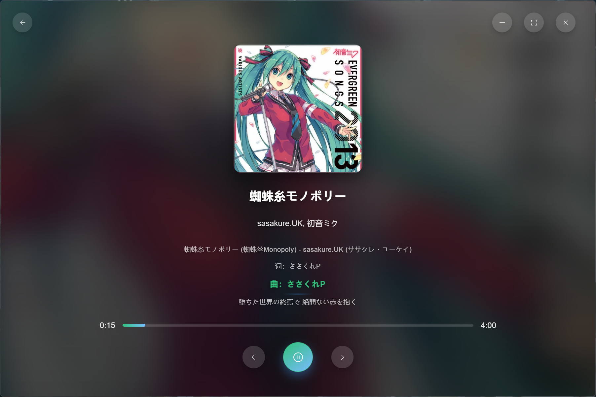
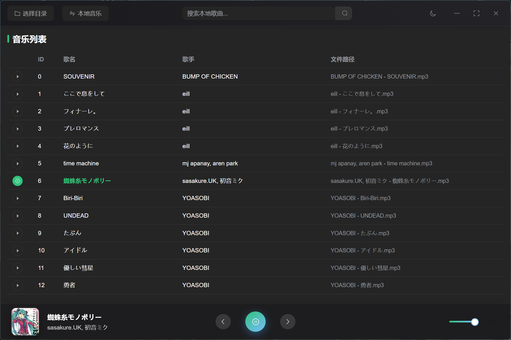

# Rmusic

基于 Tauri 2 与 Vue 3 的跨平台桌面音乐播放器，支持本地音频播放与通过第三方 API 代理的在线音乐流媒体。

[English](README.md) | [中文](README_zh.md)

[](LICENSE)
[](https://github.com/xudong7/tauri-rmusic/releases)
[](https://tauri.app/)
[](https://vuejs.org/)

---

## 目录

- [截图](#截图)
- [功能特点](#功能特点)
- [技术栈](#技术栈)
- [快速开始](#快速开始)
- [在线音乐](#在线音乐)
- [使用说明](#使用说明)
- [贡献指南](#贡献指南)
- [开发规划](#开发规划)
- [免责声明](#免责声明)
- [许可证](#许可证)
- [致谢](#致谢)

---

## 截图

 

 

 

---

## 功能特点

| 类别         | 说明                                                 |
| ------------ | ---------------------------------------------------- |
| **跨平台**   | Windows、macOS、Linux                                |
| **性能**     | Rust + Tauri，体积小、启动快                         |
| **本地播放** | 扫描文件夹，支持 MP3、WAV、OGG、FLAC                 |
| **在线音乐** | 通过网易云 API 搜索与播放（需自建本地代理）          |
| **界面**     | Vue 3 + Element Plus，明暗主题及按时段自动切换       |
| **播放**     | 音量、进度、循环、随机；歌词与全屏沉浸模式           |
| **便捷**     | 系统托盘、快捷键（空格、方向键）、带封面与歌词的下载 |
| **设置**     | 主题、下载路径、库扫描、缓存管理                     |

---

## 技术栈

| 层级 | 技术                                             |
| ---- | ------------------------------------------------ |
| 前端 | Vue 3、Element Plus、Vue Router、Pinia、Vue I18n |
| 后端 | Rust、Tauri 2.0                                  |
| 音频 | Rodio                                            |
| 网络 | Reqwest、Tokio                                   |
| 构建 | Vite、Cargo                                      |

---

## 快速开始

### 环境要求

- **Node.js** 16+
- **Rust** 与 Cargo（[rustup](https://rustup.rs/)）
- **npm** 或 **pnpm**

### 安装与运行

```bash
git clone https://github.com/xudong7/tauri-rmusic.git
cd tauri-rmusic
npm install
npm run tauri dev
```

或使用 pnpm：

```bash
pnpm install
pnpm exec tauri dev
```

### 生产构建

```bash
npm run tauri build
```

输出目录：`src-tauri/target/release/`（可执行文件）；安装包在 `src-tauri/target/release/bundle/`。

---

## 在线音乐

在线播放依赖本地网易云 API 代理服务，使用「在线音乐」前请先启动该服务。

| 服务                       | 地址                    | 仓库                                                                                          |
| -------------------------- | ----------------------- | --------------------------------------------------------------------------------------------- |
| NeteaseCloudMusicApiBackup | `http://localhost:3000` | [nooblong/NeteaseCloudMusicApiBackup](https://github.com/nooblong/NeteaseCloudMusicApiBackup) |

**步骤：**

1. 克隆、配置并运行上述服务，确保端口为 3000。
2. 在 Rmusic 中通过导航进入 **在线音乐**。
3. 搜索、播放；使用下载按钮可将歌曲保存到本地（含封面与歌词）。

---

## 使用说明

1. **本地音乐** — 选择音乐文件夹，应用会扫描并列出支持的格式，点击曲目即可播放。
2. **在线音乐** — 打开在线音乐页面，搜索后播放或下载。
3. **播放控制** — 使用底部控制栏或快捷键：`空格`（播放/暂停）、`左/右方向键`（上一首/下一首）。
4. **沉浸模式** — 点击播放栏中的封面进入全屏，查看歌词与视觉效果。
5. **设置** — 通过设置入口配置主题、下载目录、扫描选项与缓存等。

---

## 贡献指南

欢迎通过以下方式参与：

- **Bug 修复** — 提交 Issue 或 PR 修复问题。
- **新功能** — 播放逻辑或界面改进。
- **文档** — 完善 README、注释或使用说明。
- **UI/UX** — 布局、可访问性、操作流程优化。
- **国际化** — 新增或修订翻译。
- **测试** — 单元测试或集成测试。
- **建议** — 在 Issue 中提出想法或改进方案。

**流程：**

1. Fork 本仓库。
2. 创建分支：`git checkout -b feature/your-feature`。
3. 提交：`git commit -m 'feat: 你的修改'`。
4. 推送：`git push origin feature/your-feature`。
5. 发起 Pull Request。

请保持与现有代码风格一致，对复杂逻辑补充注释。较大改动建议先在 Issue 中讨论。

---

## 开发规划

- [x] 循环与随机模式
- [x] 设置：库扫描、缓存
- [ ] 主题自定义（强调色等）
- [ ] 更多语言国际化
- [ ] 更多音乐来源
- [ ] 音乐库与播放列表的导入/导出
- [ ] 正在播放系统通知

---

## 免责声明

<details>
<summary>法律与使用须知（点击展开）</summary>

1. 本项目仅供学习使用，请勿用于商业或非法用途，请尊重版权。
2. 使用过程中可能产生受版权保护的数据，本项目不拥有该数据。为降低侵权风险，请在使用后 24 小时内删除相关数据。
3. 因使用本项目而产生的任何直接、间接、特殊、偶然或后果性损害，作者不承担责任。
4. 请在符合当地法律的前提下使用本项目，用户须自行承担合规责任。
5. 请支持正版与官方音乐平台。
6. 本项目仅用于技术探索与研究，不接受任何商业合作或捐赠。
7. 若权利方认为本项目不妥，请联系维护者进行修改或移除。

</details>

---

## 许可证

[MIT](LICENSE)

---

## 致谢

- [Tauri](https://tauri.app/) — 桌面应用框架
- [Vue.js](https://vuejs.org/) — 前端框架
- [Rodio](https://github.com/RustAudio/rodio) — 音频播放
- [Element Plus](https://element-plus.org/) — UI 组件
- [NeteaseCloudMusicApiBackup](https://github.com/nooblong/NeteaseCloudMusicApiBackup) — 网易云 API 代理
